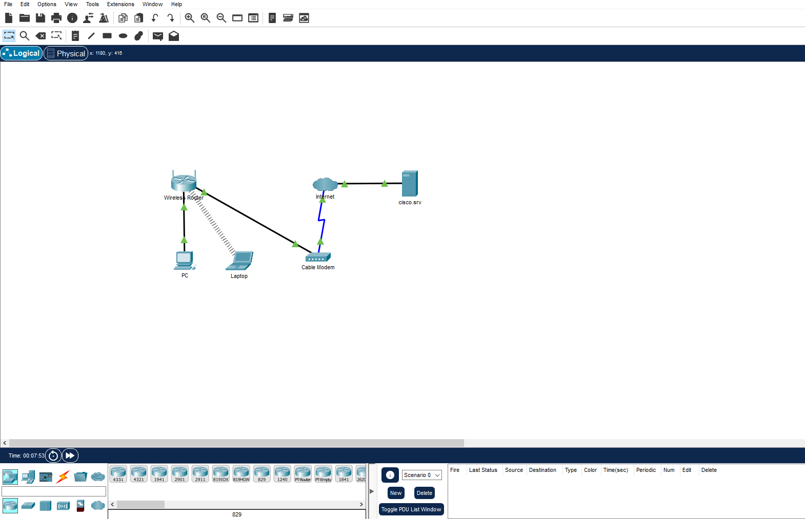

# Building a Home Network
This project simulates a secure home network using Cisco Packet Tracer. The goal is to design, configure, and secure a typical home network environment.




### How I built the home network lab

1. Added Network Devices
<ul>
 <li>Placed a wireless router, cable modem, PC, laptop, and a server (labeled cisco.srv) onto the workspace.</li>
</ul>
2. Connected Devices with Cables

 Used appropriate cables (copper straight-through or wireless connections) to connect:

 PC and Laptop to the Wireless Router

 Wireless Router to Cable Modem

 Cable Modem to the Server (via simulated Internet)

3. Configured IP Addresses

 Assigned static or dynamic IP addresses to the PC, Laptop, and Server depending on the network design.

4. Enabled Wireless Connectivity

 Set up SSID and password on the Wireless Router.

 Configured the Laptop to connect via Wi-Fi.

5. Verified Connectivity

Used the Simulation Mode or ping command to test communication between devices and ensure internet access.


#### Header 4

*   This is an unordered list following a header.
*   This is an unordered list following a header.
*   This is an unordered list following a header.

##### Header 5

1.  This is an ordered list following a header.
2.  This is an ordered list following a header.
3.  This is an ordered list following a header.

###### Header 6

| head1        | head two          | three |
|:-------------|:------------------|:------|
| ok           | good swedish fish | nice  |
| out of stock | good and plenty   | nice  |
| ok           | good `oreos`      | hmm   |
| ok           | good `zoute` drop | yumm  |

### There's a horizontal rule below this.

* * *

### Here is an unordered list:

*   Item foo
*   Item bar
*   Item baz
*   Item zip

### And an ordered list:

1.  Item one
1.  Item two
1.  Item three
1.  Item four

### And a nested list:

- level 1 item
  - level 2 item
  - level 2 item
    - level 3 item
    - level 3 item
- level 1 item
  - level 2 item
  - level 2 item
  - level 2 item
- level 1 item
  - level 2 item
  - level 2 item
- level 1 item

### Small image


### Large image


### Definition lists can be used with HTML syntax.

<dl>
<dt>Name</dt>
<dd>Godzilla</dd>
<dt>Born</dt>
<dd>1952</dd>
<dt>Birthplace</dt>
<dd>Japan</dd>
<dt>Color</dt>
<dd>Green</dd>
</dl>

```
Long, single-line code blocks should not wrap. They should horizontally scroll if they are too long. This line should be long enough to demonstrate this.
```

```
The final element.
```
