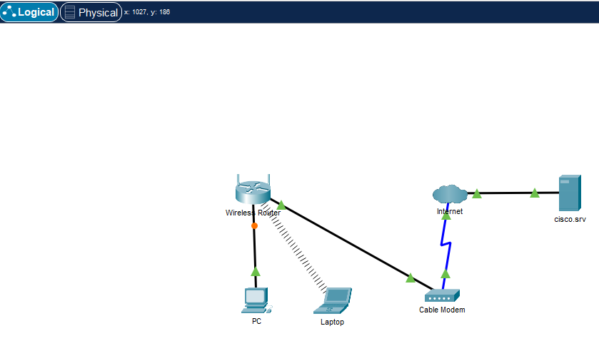

# Building a Home Network
This project simulates a secure home network using Cisco Packet Tracer. The goal is to design, configure, and secure a typical home network environment.

<a href="Screenshot_249.png" target="_blank">
  
</a>


### How I built the Home Network Lab

<ol>
  <li><strong>Added Network Devices</strong>
    <ul>
      <li>Placed a wireless router, cable modem, PC, laptop, and a server (labeled cisco.srv) onto the workspace.</li>
    </ul>
  </li>
  <li><strong>Connected Devices with Cables</strong>
    <ul>
      <li>PC and Laptop to the Wireless Router</li>
      <li>Wireless Router to Cable Modem</li>
      <li>Cable Modem to the Server (via simulated Internet)</li>
    </ul>
  </li>
  <li><strong>Configured IP Addresses</strong>
    <ul>
      <li>Assigned static or dynamic IP addresses to the PC, Laptop, and Server depending on the network design.</li>
    </ul>
  </li>
  <li><strong>Enabled Wireless Connectivity</strong>
    <ul>
      <li>Set up SSID and password on the Wireless Router.</li>
      <li>Configured the Laptop to connect via Wi-Fi.</li>
    </ul>
  </li>
  <li><strong>Verified Connectivity</strong>
    <ul>
      <li>Used the Simulation Mode or ping command to test communication between devices and ensure internet access.</li>
    </ul>
  </li>
</ol>


# Home SOC in Azure
I created a Home SOC Lab using Microsoft Azure. I created a virtual machine (VM), opened it to the internet as a honeypot, and forwarded logs to a central repository. Then integrated Microsoft Sentinel to analyze real-world attack data. 

*   This is an unordered list following a header.
*   This is an unordered list following a header.
*   This is an unordered list following a header.

##### Header 5

1.  This is an ordered list following a header.
2.  This is an ordered list following a header.
3.  This is an ordered list following a header.

###### Header 6

| head1        | head two          | three |
|:-------------|:------------------|:------|
| ok           | good swedish fish | nice  |
| out of stock | good and plenty   | nice  |
| ok           | good `oreos`      | hmm   |
| ok           | good `zoute` drop | yumm  |

### There's a horizontal rule below this.

* * *

### Here is an unordered list:

*   Item foo
*   Item bar
*   Item baz
*   Item zip

### And an ordered list:

1.  Item one
1.  Item two
1.  Item three
1.  Item four

### And a nested list:

- level 1 item
  - level 2 item
  - level 2 item
    - level 3 item
    - level 3 item
- level 1 item
  - level 2 item
  - level 2 item
  - level 2 item
- level 1 item
  - level 2 item
  - level 2 item
- level 1 item

### Small image


### Large image


### Definition lists can be used with HTML syntax.

<dl>
<dt>Name</dt>
<dd>Godzilla</dd>
<dt>Born</dt>
<dd>1952</dd>
<dt>Birthplace</dt>
<dd>Japan</dd>
<dt>Color</dt>
<dd>Green</dd>
</dl>

```
Long, single-line code blocks should not wrap. They should horizontally scroll if they are too long. This line should be long enough to demonstrate this.
```

```
The final element.
```
